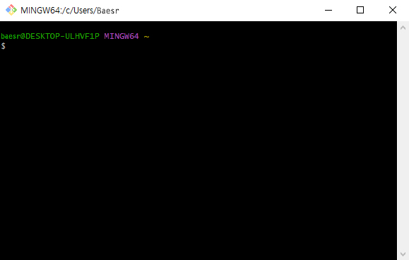
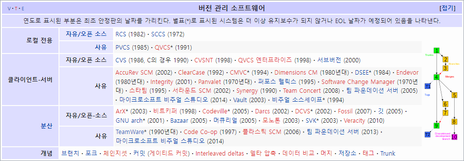

# CLI (Command Line Interface)

#### 1. 기초

- 명령 줄 인터페이스 또는 명령어 인터페이스라고 함
  - 명령 기반의 인터페이스
  - cf. GUI(Graphic User Interface)는 그래픽 기반의 인터페이스임
- 가상 [터미널](https://gggggeun.tistory.com/39) 또는 텍스트 터미널을 통해 사용자와 컴퓨터가 상호 작용하는 방식을 뜻함
- 작업 명령은 사용자가 툴바 키보드 등을 통해 문자열의 형태로 입력하며, 컴퓨터로부터의 출력 역시 문자열의 형태로 주어짐
- 이와 같은 인터페이스를 제공하는 프로그램을 명령 줄 해석기 또는 셸이라고 부름
  - 유닉스 셸(sh, ksh, csh, tcsh, bash 등)과 CP/M, 도스의 명령 프롬프트(command.com) 등이 있음


#### 2. 기본 인터페이스

- 컴퓨터 정보, [디렉토리](https://wnw1005.tistory.com/435), $

 

 


#### 3. 디렉토리 관리
- pwd : 현재 디렉토리 출력(Print working directory)
- cd *디렉토리이름* : 디렉토리 이동(Change directory)
  
  - . : 현재 디렉토리
  - .. : 상위 디렉토리
  - 그래서 git add . 는 현재 폴더에 대한 모든 파일의 변경사항을 add 하게 됨
- ls : 목록(List)
- mkdir : 디렉토리 생성(Make directory)
- touch : 파일 생성
- rm *파일명*  : 파일 삭제하기(Remove)
- rm –r *폴더명* : 폴더 삭제하기


# 버전관리시스템

- 버전관리, 소스코드 관리란 동일한 정보에 대해 여러 버전을 관리하는 것을 말함

  > In software engineering, version control (also known as revision control, source control, or source code management) is a class of systems responsible for managing changes to computer programs, documents, large web sites, or other collections of information.

  


# Git

### 정의

- Git은 **분산버전관리시스템**으로 코드의 버전을 관리하는 도구
- 2005년 [리눅스 커널](https://5equal0.tistory.com/entry/Linux-Kernel-%EC%BB%A4%EB%84%90%EC%9D%98-%EA%B0%9C%EB%85%90%EA%B3%BC-%EC%BB%A4%EB%84%90%EC%9D%98-%EA%B5%AC%EC%A1%B0)을 위한 도구로 리누스 토르발스가 개발함
- 컴퓨터 파일의 변경사항을 추적하고 여러 명의 사용자들 간에 해당 파일들의 작업을 조율함


### 분산버전관리시스템(DVCS)

- 중앙집중식버전관리시스템 : 중앙에서 버전을 관리하고 파일을 받아서 사용하는 것
- 분산버전관리시스템 : 원격 저장소(Remote Repository)를 통해 협업하고, 모든 히스토리를 클라이언트들이 공유하는 것


### Git 저장소(Git Repository)

#### 1. 기본 명령어

| 명령어                        | 내용                            |
| :---------------------------- | :------------------------------ |
| git init                      | 로컬 저장소 생성                |
| git add *파일명*              | 특정 파일/폴더의 변경 사항 추가 |
| git commit -m '*커밋 메시지*' | 버전 기록 (commit)              |
| git status                    | 상태 확인                       |
| git log                       | 버전 확인                       |


#### 2. 기본 흐름

- 1)작업을 하면 2) add해서 Staging Area에 모아 3) commit으로 버전을 기록함
   
   
- Git은 파일을 modified, staged, committed로 관리함

  - tracked : 이전부터 버전으로 관리되고 있는 파일
    - unmodified : git status에 나타나지 않음
    - modified : 파일이 수정된 상태 (add 명령어를 통해 Staging Area로 보냄)
    - staged : 수정한 파일을 곧 커밋할 것이라고 표시한 상태 (commit 명령어를 통해 저장소로 보냄)
    - committed : 커밋이 된 상태
  
  - untracked : 버전으로 관리된 적이 없는 파일, 즉 파일을 새로 만든 경우를 말함
  
 - 파일 라이프사이클
   
   
   
   


#### 3. 명령어  `init`

```bash
$ git init
```

- 특정 폴더를 Git 저장소로 만들어 Git으로 관리함
- .git 폴더가 생성되며 git bash에서는 (master)라는 표기를 확인할 수 있음


#### 4. 명령어  `add`

```bash
$ git add (file_name)
```

- 작업 폴더(Working Directory) 상의 변경 내용을 Staging Area에 추가하기 위해 사용함
- untracked/modified 상태의 파일을 staged로 변경함


#### 5. 명령어  `commit`

```bash
$ git commit –m ‘(commit message)’
```

- staged 상태의 파일들을 commit을 통해 버전으로 기록함
- [SHA-1 해시](https://velog.io/@ejjjang0414/%ED%94%84%EB%A1%9C%EA%B7%B8%EB%9E%98%EB%B0%8D-SHA-1-%EC%9D%B4%EB%9E%80-%EB%AC%B4%EC%97%87%EC%9D%B8%EA%B0%80)를 사용하여 40자 길이의 [체크섬](https://ko.101-help.com/cekeuseomiran-mueosimyeo-cekeuseomeul-gyesanhaneun-bangbeob-bc9d511ad0/)(checksum)을 생성하고, 이를 통해 고유한 커밋을 표기함
- 커밋 메시지는 변경 사항을 나타낼 수 있도록 명확하게 작성해야 함


- Git은 데이터를 파일 시스템의 스냅샷으로 관리하며 크기가 매우 작음

- 파일이 달라지지 않으면 성능을 위해 파일을 새로 저장하지 않음

- 기존의 델타 기반 버전 관리시스템과 가장 큰 차이를 가지는 부분임

  


#### 6. 명령어  `log`

```bash
$ git log
```

- 현재 저장소에 기록된 커밋을 조회함
- 다양한 옵션을 통해 로그를 조회할 수 있음
  - $ git log -1 : 최근 로그 1개를 조회함
  - $ git log --oneline : 로그를 한줄로 조회함
  - $ git log -2 --oneline : 최근 로그 2개를 한줄로 조회함


#### 7. 명령어  `status`

```bash
$ git status
```

- Git 저장소에 있는 파일의 상태를 확인하기 위하여 활용 됨
  - 파일의 상태를 알 수 있음
    - Untracked files
    - Changes not staged for commit (modified)
    - Changes to be committed (staged)
  - Noting to commit, working tree clean
- status로 확인할 수 있는 파일의 상태 : tracked(unmodified, modified, staged), untracked


# Git의 활용

#### 1. Git 설정 파일  `config` ([configuration](https://coding-groot.tistory.com/97))

- 사용자 정보(Commit Author) : 커밋을 하기 위해 반드시 필요함

  ```bash
  $ git config —global user.name '(GitHub username)'
  $ git config —global user.email '(GitHub id@email.com)'
  ```

- —system
  
  - 경로 : /etc/gitconfig
  - 시스템의 모든 사용자와 모든 저장소에 적용 됨 (관리자 권한)
- —global
  
  - 경로 : ~/.gitconfig
  - 현재 사용자에게 적용 됨
- —local
  
  - 경로 : .git/config
  - 특정 저장소에만 적용 됨


#### 2. Git 실습 : TIL 프로젝트 관리

 1. TIL 폴더를 만들고 Git 저장소를 만들기

    ```bash
    #1 저장소 생성
    Baesr@DESKTOP-ULHVF1P MINGW64 ~/Desktop/TIL
    $ git init
    Initialized empty Git repository in C:/Users/Baesr/Desktop/TIL/.git/
    
    #2 사용자 정보 생성
    Baesr@DESKTOP-ULHVF1P MINGW64 ~/Desktop/TIL (master)
    $ git config --global user.name 'baeseorim'
    
    Baesr@DESKTOP-ULHVF1P MINGW64 ~/Desktop/TIL (master)
    $ git config --global user.email 'bae001449@gmail.com'
    ```

    

 2. README.md 파일을 만들고 커밋하기

    ```bash
    #1 README를 add
    Baesr@DESKTOP-ULHVF1P MINGW64 ~/Desktop/TIL (master)
    $ git add README.md
    
    #2 README를 commit
    Baesr@DESKTOP-ULHVF1P MINGW64 ~/Desktop/TIL (master)
    $ git commit -m 'readme'
    [master (root-commit) 48acf07] readme
     1 file changed, 8 insertions(+)
     create mode 100644 README.md
    
    #3 commit 확인 : log
    Baesr@DESKTOP-ULHVF1P MINGW64 ~/Desktop/TIL (master)
    $ git log
    commit 48acf07565b9aba1f5895ed119662be42e3a9684 (HEAD -> master)
    Author: baeseorim <bae001449@gmail.com>
    Date:   Wed Jul 6 01:08:53 2022 +0900
    
        readme
    ```

    

 3. 오늘 작성한 마크다운 파일을 옮기고 커밋하기

    ```bash
    #1 markdown 파일들을 add
    Baesr@DESKTOP-ULHVF1P MINGW64 ~/Desktop/TIL (master)
    $ git add markdown_lesson.md markdown_practice.md
    
    #2 markdown 파일들을 commit
    Baesr@DESKTOP-ULHVF1P MINGW64 ~/Desktop/TIL (master)
    $ git commit -m 'markdown lesson'
    [master 5b206f4] markdown lesson
     2 files changed, 195 insertions(+)
     create mode 100644 markdown_lesson.md
     create mode 100644 markdown_practice.md
    
    #3 commit 확인 : log
    $ git log -1
    commit 5b206f4020f314324a45e4f48d431f50833f0de5 (HEAD -> master)
    Author: baeseorim <bae001449@gmail.com>
    Date:   Wed Jul 6 01:09:50 2022 +0900
    
        markdown lesson
    ```

    

 4. 오늘 배운 내용들을 정리하고 커밋하기

    ```bash
    #1 git 파일들을 add
    Baesr@DESKTOP-ULHVF1P MINGW64 ~/Desktop/TIL (master)
    $ git add git_lesson.md git_lesson.assets
    
    #2 git 파일들을 commit
    Baesr@DESKTOP-ULHVF1P MINGW64 ~/Desktop/TIL (master)
    $ git commit -m 'git lesson'
    [master ee2114d] git lesson
     6 files changed, 336 insertions(+)
     create mode 100644 git_lesson.assets/git_bash.jpg
     create mode 100644 git_lesson.assets/git_commit.png
     create mode 100644 git_lesson.assets/git_flow.png
     create mode 100644 git_lesson.assets/git_lifecycle.png
     create mode 100644 git_lesson.assets/version_control_sw.jpg
     create mode 100644 git_lesson.md
    
    #3 commit 확인 : log
    Baesr@DESKTOP-ULHVF1P MINGW64 ~/Desktop/TIL (master)
    $ git log -1
    commit 7e0f2e7f42da59a0ef946b27add1b3dfa9f08734 (HEAD -> master)
    Author: baeseorim <bae001449@gmail.com>
    Date:   Wed Jul 6 01:11:37 2022 +0900
    
        git lesson
    
    #4 최종 status
    $ git status
    On branch master
    nothing to commit, working tree clean
    ```

    

    

